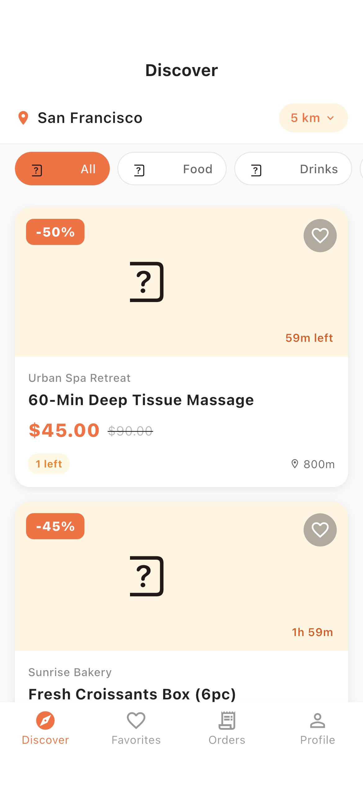
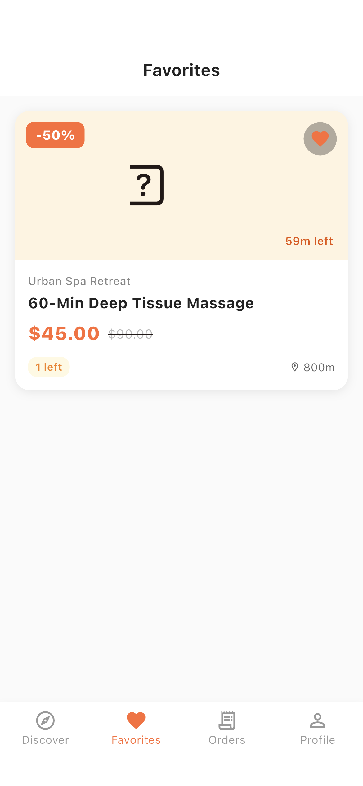
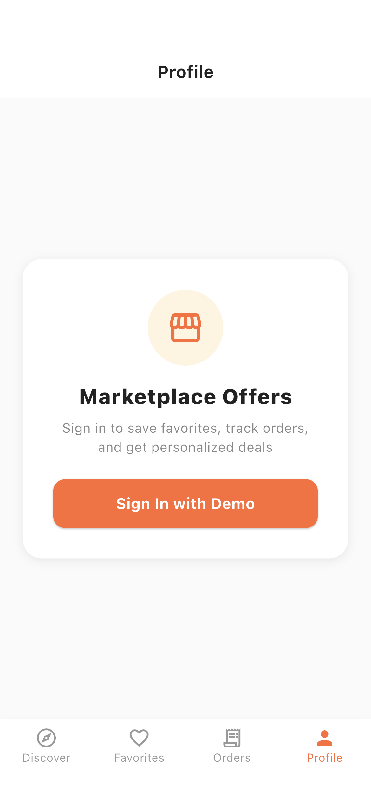
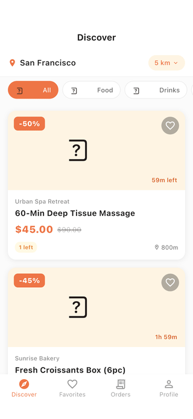

# Marketplace Offers

A Flutter marketplace app for discovering time-limited local deals. Browse nearby offers by category and search radius, see live expiry countdowns and scarcity ("1 left") badges, save favorites, open a detail page to "grab" a deal, and track orders. Built with Flutter, Riverpod state management, and go_router shell navigation.

## Demo

These are real captures from the iOS Simulator, produced by an integration-test driver (no mockups). See [FLOW.md](FLOW.md) for how they are generated.

| Discover | Offer Detail | Favorites | Profile |
| --- | --- | --- | --- |
|  |  |  |  |

## Features

- Discover feed of nearby offers with category chips and an adjustable search radius
- Live countdown timers to offer expiry, plus scarcity badges ("1 left")
- Discount pricing with original vs. discounted price
- Tap an offer to view full details and "Grab This Deal"
- Favorite offers and review them on a dedicated Favorites tab
- Orders tab and demo sign-in on the Profile tab

## Stack

- Flutter (Material 3)
- Riverpod (StateNotifier) for state management
- go_router with a ShellRoute bottom-navigation scaffold
- Hive, uuid, intl
